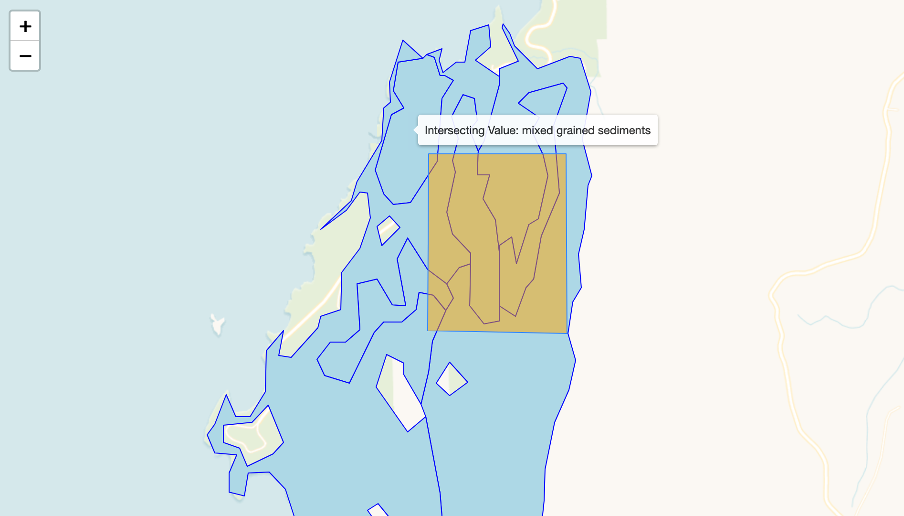
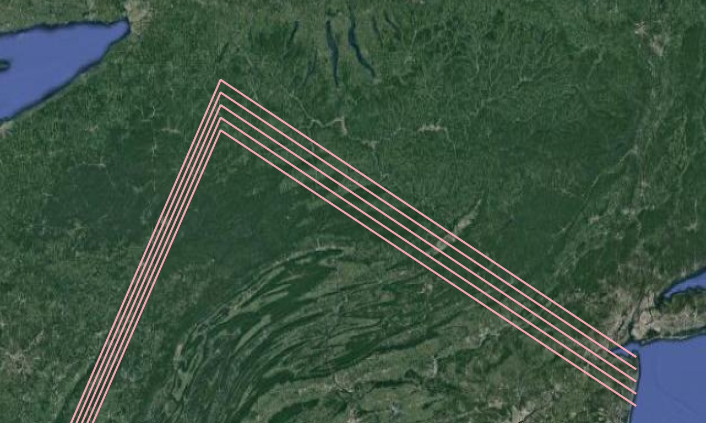
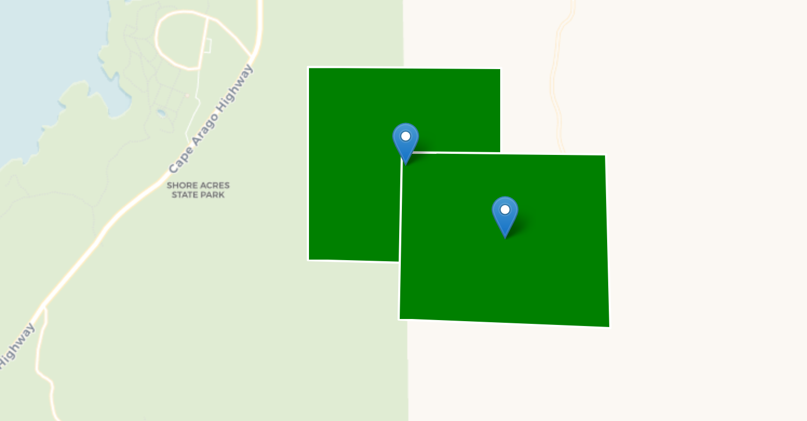

# map675-module-03-once-aday-assignment-03

#### Client and Server Side Processing Scripts

**Client:**

- Concatenate Attribute Results of overlapping Polygons within a Multi-polygon by a Specific Attribute, Show Results
- Center Points in Polygon - Client

**Server:**

- Distance from many polygons
- Duplicate and Shift Points

### Concatenate Attribute Results of overlapping Polygons within a Multi-polygon by a Specific Attribute - Client

Create 2 datasets with overlapping Polygons. Choose an Attribute to monitor.

  

I was able to get the script working by using the intersect method of turf

There were lots of bugs with multi polygons when I brought in a complex geology dataset.

I had to impliment a lot of error handling for when turf attempts to read the JSON object as a polygon and execute intersect. If there is a geometry error I assume that the json object/polygon has deeper arrays in it's structure and continue to loop through the geometry and attempt to convert it to a polygon. I do this for about "3 levels" and if it goes deeper than that I stop. For the complicated geology dataset this gave good results.

I also had to simplify some of the topology for the geology dataset because it was causing errors with the Turf intersect function:

`let poly2 = turf.polygon(turf.cleanCoords(y['geometry']['coordinates']),{"intersectingValue":y['properties'][ds1AttributeName]})`

Here I use turf.cleanCoords to remove redudant coordinates from the geometry.

https://turfjs.org/docs/#cleanCoords

In that example I am also converting the raw JSON coordinates to a polygon and adding the attribute from the JSON object to the new Turf-ready Polygon. So that if there is a successful intersect that attribute value will carry over to the Polygon and I can also use it to push to the final intersectingAttributes array that is presented to that client.

### Distance from many polygons - Server

This script will take a specified point location and multipolygon dataset and determine the distance from that point to the different polygon shapes.

I had to dig into the turf FeatureEach looping function. It wasn't straightforward how to loop through the features without creating a sub-loop within the FeatureEach loop itself. This is something I need to look into and understand better in the future since it seems like an important feature of turf.

### Duplicate and Shift Line - Server

This script takes a Line, duplicates it x times, and shifts it y distance each time it's duplicated.

  

This was inspired by a project I did once at work where we wanted to map vineyard trellis rows, which are typically straight lines. Instead of manually drawing each row... we can draw one, (and knowing direction from North that it is plus the distance between rows), can duplicate it in the correct direction. After that we would clip it to the vineyard boundary.

## Center Points in Polygon - Client

This script will take a polygon dataset and generate points at the center of each polygon. The points are added to the web map, on top of the polygon dataset, as they are generated.
